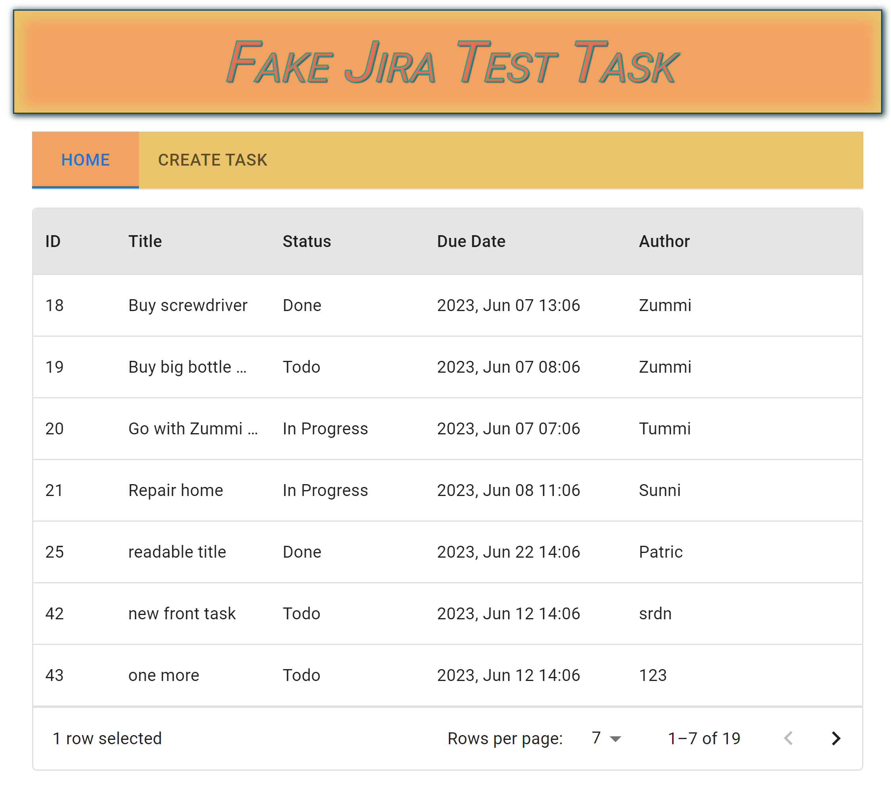

## Task:
You need to develop a web application for task management. The application should allow
users to create new tasks, view existing tasks, and mark completed tasks.
The application should include the following pages:
- [x] Task creation page
- [x] Task list viewing page
- [x] Modal window with detailed information about the task (not page)
The task creation page should have fields for entering the task title, description, and due date.
The task list viewing page should display all tasks sorted by due date (the closest tasks should
be at the top).
When clicking on a task in the list, the detailed task information modal should open, which
displays the task title, description, and due date. Also, on the detailed task information modal,
there should be an option to mark the task as completed.

## Tech stack:
Backend: JS, Node, Express, MySQL, WebSocket;

Frontend: JS, TS, React, Material-UI, WebSocket, state management(any).

## Evaluation of completed task:
The evaluation of the completed task will be based on the following criteria:

**Application functionality:** all requirements described above must be implemented, and the
application must work without errors.

**Code quality:** the code should be clean, understandable, well-structured, and must comply with
modern web development standards.

**Design and user interface:** the application should have a pleasant and intuitive design that
provides convenient user interaction with the application.
Testing: the application must be tested for compliance with the requirements and must work
without errors.

---
Backend config for IDEA

```DEV_DB_HOSTNAME=localhost;DEV_DB_NAME=fake_jira;DEV_DB_PASSWORD=password123;DEV_DB_USERNAME=user123;NODE_ENV=development;PORT=9000;PROD_DB_HOSTNAME=localhost;PROD_DB_NAME=fake_jira_prod;PROD_DB_PASSWORD=3579password;PROD_DB_USERNAME=realuser123;TEST_DB_HOSTNAME=localhost;TEST_DB_NAME=fake_jira_test;TEST_DB_PASSWORD=1356789test;TEST_DB_USERNAME=testuser123;WEBSOCKET_PORT=3155```

---
## Start application
execute command `docker compose up -d`
backend will work on 3030 port, websocket on 3155
for fill seeds into database, go to API docker container and execute command `npm run seed:up`

---
## Conclusion

I made a concerted effort to showcase my skills by applying various approaches in the development of this task management web application. To demonstrate my proficiency, I employed the strategy pattern, pub-sub architecture, class-based organization to separate business logic from requests, and implemented handlers for both HTTP requests and WebSocket messages. Additionally, I wrote functional tests to ensure the application's functionality.

Given more time, I would have further enhanced the project by incorporating additional elements such as a request validation library, more extensive testing, pagination, Swagger for API documentation, and other improvements. However, I believe that I have fulfilled the requirements of the task and demonstrated my abilities. There is always room for improvement, as there are no limits to perfection.

Thank you for considering my work, and I look forward to discussing any feedback or further opportunities

I am pleased to have successfully completed the test assignment for the web application task management project. Throughout the development process, I applied various techniques and approaches to showcase my skills and expertise.

First and foremost, I implemented the requested functionality with great attention to detail. The application allows users to create new tasks, view existing tasks, and mark tasks as completed. I designed and implemented the following key pages:

Task Creation Page: This page features fields for entering the task title, description, and due date. It enables users to conveniently create new tasks with relevant information.

Task List Viewing Page: This page displays all tasks in a sorted order based on their due dates. The tasks with the closest deadlines are prioritized and listed at the top. Users can easily access and manage their tasks from this page.

Detailed Task Information Modal Window: I implemented a modal window to provide users with additional details about a specific task. When a task is clicked in the list, the modal window opens, displaying the task title, description, due date, and an option to mark the task as completed. This allows users to access important task information without leaving the main task list page.

In terms of the technology stack, I utilized JS, Node.js, Express, MySQL, and WebSocket for the backend development. On the frontend side, I employed JS, TypeScript, React, Material-UI, WebSocket, and a redux library. These technologies helped me ensure a seamless and efficient development process.

To evaluate the completed task, I considered three essential criteria:

Application Functionality: I meticulously implemented all the specified requirements, ensuring that the application works flawlessly without any errors.

Code Quality: I followed best practices in software development, resulting in clean, well-structured, and maintainable code. I adhered to modern web development standards to ensure code readability and scalability.

Design and User Interface: I paid careful attention to the application's design, aiming for a pleasant and intuitive user interface. The design choices and interactions were carefully crafted to provide users with a seamless and enjoyable experience while managing their tasks.

---
## Notes
- Added umzug script for clear database on tests before run tests. Then execute migrations
- Added a lot of validation in business logic because don't have validator for requests.
When this task will be done, I want to add AJV validator and make more clear business logic
- Added 'individualHooks' to beforeBulkDestroy/Update for more comfortable work with this hook. Wrote comment about it in model
- Application don't should store data - all cache better move to redis
- Need add validation library, for check validation in one place, like AJV

---
## Screenshots




